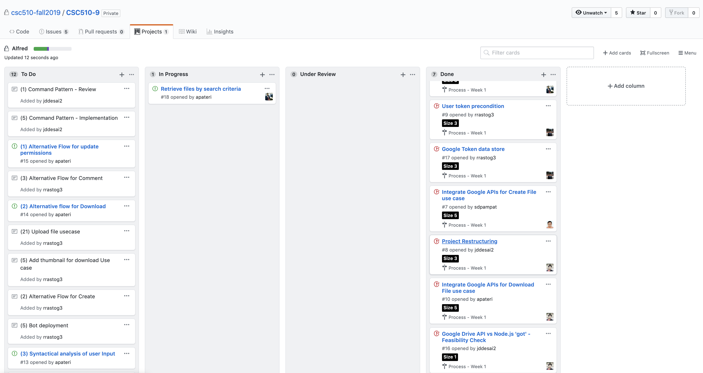

## Process

### Defining Tasks and Labels

 - **Epics**: We defined our Epics right after the Design Milestone.
 
 
 
 - **Tasks**: The first thing we did for the Process Milestone is break down the epics into tasks. We added the tasks as notes to the Alfred Project Board. While adding the tasks, we added a rough estimate inside the paranthesis () as it was a requirement. The final effor estimation was done using the Sprint Planning meeting.
 
 - **Labels**: For story points, we created `Size` labels `{1, 3, 5, 8, 21}`. We only used 21 for the Epics that were not broken down. We also created two milestones `Process - Week 1` and `Process - Week 2` to identify sprints.
 
 - **Project Board**: We used the GitHub project board as an issue tracker. The board was populated with all the tasks as notes in the beginning.

### Development Flow

 - Pick a task
 - Convert the task to an issue
 - Assign appropriate `Size` label
 - Add the `Milestone` label
 - Move the card from `To Do` swimlane to `In Progress`
 - Once the task is finished, move the task from `In Progress` to `Under Review`
 - This task is then reviewed by any one team mate* and review comments are added if any
 - Once reviewed, the issue is closed and moved to `Done`

*We tried to follow this but due to different course schedules and timelines, sometimes the developer who worked on the task closed the issue if it was not reviewed for over a day. If it was a small change, the developer himself added necessary comments and closed the issue.

**The activity on a task can be seen in the screenshot below dated October 26, 2019**

 
### Meetings

#### Sprint Planning

We conducted a Sprint Planning meeting at the beginning of both the sprints. To estimate the effort, we used calculator in our mobile phones instead of Planning Poker; on the count of three, we raised our phones with the story points typed in the calculators. We had major conflicts for a couple tasks, one of them was Context Management. We discussed on the conflict and contradicting opinions but could not come to a consensus. As a solution to this issue, we decided to establish a **Baseline** which is a task worth 1 story point. We used this baseline as a relative effor and assigned the story points. Baseline for our project is: **Smallest alternate flow for any use-case. For instance if a user provides an invalid filename, Alfred should post a reply on the incoming channel with appropriate message.**
 
#### Scrum 

We could not conduct a daily scrum meeting but we had a bi-weekly meeting. We discussed on what issues we faced and how we can collaborate and pick tasks in a way that there are fewer conflicts.
 
#### Retrospective

At the end of first sprint we conducted a retrospective meeting. The agenda of this meeting was to understand _What went wrong?_, _How can we avoid similar problem in upcoming sprint?_. Some isses we faced are:

 - Even after coming to a consensus on the effort required for a task, we misjudged effor for some tasks by a very big margin. For instance the Google Authoriaztion part.
 
 - We started working on the tasks independently and had scrum meetings every 3 or 4 days. We felt that it would have been better if we had daily scrums. So for second sprint, we had 5 scrum meetings.

 - We did not segregate inter-dependent tasks properly. For example if a developer is working on download files use case, listing files for reference is a sub task. We started in a way that one developer is working on list files while other is working on download file. Unless the list file task is completed, download cannot work because of the way Google Drive API works.
 
 - We used dummy data as a workaround for the problem above but when had hard time merging the changes, which leads to the last and the most important issue we discussed in the retrospective meeting - _We did not decide on the common coding practices, naming conventions, file and directory segragations etc. We had a hard time integrating stuff even with SOTA version control systems._
 
### Sprint 1

At the end of first iteration, our board looked something like this

### Sprint 2

We are not dont with the final spring yet but as of today (November 7, 2019), our board looks something like this

## Practices

## Consistency

